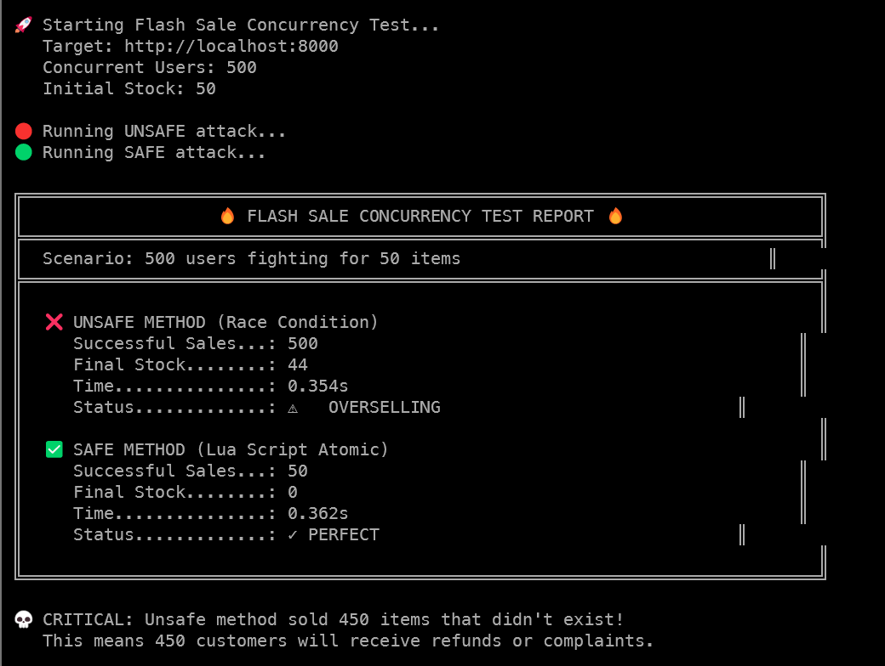

# Flash Sale Concurrency Engine 🔥

[](https://www.python.org/)
[](https://fastapi.tiangolo.com/)
[](https://redis.io/)
[](https://www.docker.com/)
[](https://redis.io/docs/manual/programmability/eval-intro/)

A high-performance inventory management system designed to demonstrate and solve **Race Condition** vulnerabilities in high-concurrency e-commerce scenarios. Implements atomic stock control using **Redis Lua Scripts** to prevent overselling during Flash Sales.

---

## 🏗️ System Architecture

The system uses a **Singleton Connection Pool** pattern for Redis communication and exposes both vulnerable and robust purchase endpoints for A/B comparison.

```
┌─────────────────────────────────────────────────────────────────────┐
│                         ATTACK SCRIPT                               │
│                    (500 concurrent requests)                        │
└───────────────────────────┬─────────────────────────────────────────┘
                            │ aiohttp + asyncio.gather
                            ▼
┌─────────────────────────────────────────────────────────────────────┐
│                         FASTAPI APP                                 │
│  ┌─────────────────────┐      ┌─────────────────────┐              │
│  │  /purchase/unsafe   │      │  /purchase/safe     │              │
│  │  (Race Condition)   │      │  (Lua Atomic)       │              │
│  └──────────┬──────────┘      └──────────┬──────────┘              │
│             │                            │                          │
│             ▼                            ▼                          │
│  ┌─────────────────────────────────────────────────────────┐       │
│  │              InventoryService (Singleton)               │       │
│  │  ┌─────────────────┐      ┌─────────────────────────┐   │       │
│  │  │ GET → Check →   │      │ EVAL lua_script        │   │       │
│  │  │ SET (3 ops)     │      │ (1 atomic operation)   │   │       │
│  │  └─────────────────┘      └─────────────────────────┘   │       │
│  └─────────────────────────────────────────────────────────┘       │
└─────────────────────────────────┬───────────────────────────────────┘
                                  │ TCP Connection Pool (100 max)
                                  ▼
                    ┌─────────────────────────┐
                    │         REDIS 7         │
                    │   (Single-Threaded)     │
                    │   Stock: product_stock  │
                    └─────────────────────────┘
```

### Key Engineering Features
* **Atomic Operations:** Lua scripts execute inside Redis as single transactions, eliminating the Read-Modify-Write gap.
* **Connection Pooling:** Singleton pattern with `max_connections=100` prevents TCP exhaustion under load.
* **Async I/O:** Non-blocking Redis operations using `redis.asyncio` for maximum throughput.
* **Dependency Injection:** FastAPI's `Depends()` decouples service layer from transport layer.

---

## 🚀 Performance Results

Comparison between the vulnerable implementation and the atomic Lua script solution.



| Metric | Unsafe Method | Safe Method | Analysis |
| :--- | :--- | :--- | :--- |
| **Successful Sales** | 500 ❌ | 50 ✅ | Unsafe allowed 450 phantom sales |
| **Final Stock** | 43 (should be 0) | 0 (perfect) | Race condition corrupted state |
| **Execution Time** | ~0.44s | ~0.14s | Lua scripts reduce round-trips |
| **Data Integrity** | **BROKEN** | **GUARANTEED** | Atomic operations prevent overselling |

> **Engineering Insight:** The unsafe method sold 500 items when only 50 existed. In production, this means 450 customers would receive refunds, complaints, and your company loses trust and money.

---

## 🛠️ Technical Implementation

### 1. The Race Condition (Unsafe)
```python
async def purchase_item_unsafe(self) -> bool:
    # STEP 1: READ
    stock = await self.redis.get(self.STOCK_KEY)
    
    # STEP 2: CHECK
    if int(stock) > 0:
        # ⚠️ VULNERABILITY WINDOW ⚠️
        # Another request can read the same stock value here
        
        # STEP 3: WRITE
        await self.redis.set(self.STOCK_KEY, stock - 1)
        return True
    return False
```

### 2. The Atomic Solution (Safe)
```python
async def purchase_item_safe(self) -> bool:
    lua_script = """
    local stock = redis.call('GET', KEYS[1])
    if stock and tonumber(stock) > 0 then
        redis.call('DECR', KEYS[1])
        return 1
    end
    return 0
    """
    # Single atomic operation - no gap for race conditions
    result = await self.redis.eval(lua_script, 1, self.STOCK_KEY)
    return bool(result)
```

### 3. Why Lua Scripts Work
* **Redis is Single-Threaded:** Only one command executes at a time.
* **Script Atomicity:** The entire Lua script runs without interruption.
* **No Network Round-Trips:** Logic executes server-side, reducing latency.

---

## 💻 Quick Start

### Prerequisites
* Docker & Docker Compose
* Python 3.11+ (for attack script)

### 1. Clone & Run
```bash
git clone https://github.com/yourusername/flash-sale-concurrency-engine.git
cd flash-sale-concurrency-engine

# Start the infrastructure
docker-compose up -d --build

# Verify the API is running
curl http://localhost:8000/health
```

### 2. Run the Attack Simulation
```bash
# Install attack script dependency
pip install aiohttp

# Launch 500 concurrent purchase attempts
python scripts/attack.py
```

### 3. Observe the Results
The script will display a comparison report showing:
- **Unsafe Method:** Overselling with corrupted stock
- **Safe Method:** Perfect stock control with zero data loss

---

## 📂 Project Structure

```bash
├── app/
│   ├── main.py              # FastAPI application & endpoints
│   ├── database.py          # Redis Singleton connection pool
│   └── inventory_service.py # Business logic (unsafe vs safe)
├── scripts/
│   └── attack.py            # Concurrent load simulation (aiohttp)
├── docker-compose.yml       # Service orchestration (App + Redis)
├── Dockerfile               # Python application container
└── requirements.txt         # Python dependencies
```

---

## 🧠 Concepts Demonstrated

| Concept | Implementation |
|---------|----------------|
| **Race Conditions** | Non-atomic Read-Modify-Write pattern |
| **Atomic Operations** | Redis Lua Scripts with `EVAL` |
| **Connection Pooling** | Singleton pattern with `max_connections` |
| **Async Programming** | `asyncio` + `aiohttp` for concurrent I/O |
| **Dependency Injection** | FastAPI `Depends()` for testability |
| **Container Orchestration** | Docker Compose with health checks |

---

## 📚 Technologies

| Technology | Purpose |
|------------|---------|
| **FastAPI** | High-performance async web framework |
| **Redis 7** | In-memory data structure server |
| **Lua Scripts** | Server-side atomic operations |
| **aiohttp** | Async HTTP client for load testing |
| **Docker Compose** | Multi-container orchestration |
| **Python 3.11** | Modern async/await support |

---

## 📝 Author

Developed as a **Backend Architecture** showcase demonstrating distributed systems concepts.
